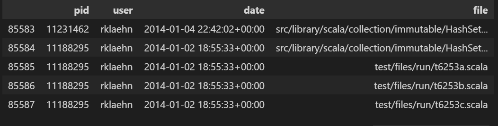

The GitHub History of the Scala Language 📚📈 

  ## :eyes: Scala
 

Scala est un langage de programmation multi-paradigme comme Python, qui combine programmation fonctionnelle et orientée objet. Il fonctionne sur la machine virtuelle Java (JVM). Il a été développé en 2004 par Martin Oderski et est censé être plus rapide et plus convivial pour les développeurs.

<!-- TABLE OF CONTENTS -->

  
PLAN DE TRAVAIL

  <ol>
    <li>
      <a href="#about-the-project">Données du dépôt de projets réels de Scala</a>
    </li>
     <li>
      <a href="#about-the-project"> Préparation et nettoyage des données</a>
    </li>
     <li>
      <a href="#getting-started">Fusionner les DataFrames</a>
      <ul> </ul>
    </li>
    <li>
      <a href="#getting-started">Le projet est-il encore activement maintenu</a>
    </li>
    <li>
      <a href="#getting-started">Y a-t-il de la camaraderie dans le projet ?</a>
    </li>
     <li>
      <a href="#getting-started">Quels sont les fichiers qui ont été modifiés dans les dix dernières pull requests ?</a>
    </li>
    <li>
      <a href="#getting-started">Qui a fait le plus de pull requests sur un fichier donné ?</a>
    </li>
     <li>
      <a href="#getting-started"> Qui a fait le plus de pull requests sur un fichier donné ?</a>
    </li>
     <li>
      <a href="#getting-started">  Les pull requests de deux développeurs particuliers</a>
    </li>
     <li>
      <a href="#getting-started"> Visualiser les contributions de chaque développeur</a>
    </li>
    

<!-- ABOUT THE PROJECT -->
## :star2:  A propos du projet

Les projets open source contiennent des historiques de développement complets, tels que les personnes qui ont apporté des modifications, les modifications elles-mêmes et les revues de code. Dans ce projet, vous devrez lire, nettoyer et visualiser le référentiel d'un projet Scala réel, qui comprend des données provenant d'un système de contrôle de version (Git) et d'un site d'hébergement de projets (GitHub). Avec près de 30 000 commits et une histoire qui s'étend sur plus de dix ans, Scala est un langage mature. Vous découvrirez qui a eu le plus d'influence sur son développement et qui sont les experts.

## :hammer_and_wrench: Prérequis

 
  * python
  * Jupyter Notebook

## :gear:  Loading libraries 

<li> import pandas as pd</li>
<li> import matplotlib </li>

## 👩‍🏫 Préparation des données

notre projet composé de trois fichiers : <mark>pulls_2011-2013.csv :</mark> contient les informations de base sur les demandes de pull, et s'étend de la fin de l'année 2011 jusqu'à (mais non compris) 
2014.s  
<mark>pulls_2014-2018.csv :</mark> contient des informations identiques, et s'étend de 2014 à 2018. 
<mark>pull_files.csv :</mark>contient les fichiers qui ont été modifiés par chaque demande de retrait.

*  Et pour faciliter le travail nous devrons combiner les données des deux DataFrames pull  <code> pulls_2011-2013.csv</code> <code>pulls_2014-2018.csv </code> distincts pour travailler sur un seul dataframe.
 

* Ainsi nous avons fusionner  les des deux DataFrames  <code>pulls</code> <code>pull_files.csv </code> ,nous permettra d'analyser plus facilement les données dans les tâches futures.
  ####  Voila le resultat final : 
  

##  📊  Visualisation de données

* apres l'analyser nous avons constate que les personnes que a fait le plus nomber de pull et nomber de modification sur les fichiers se sont les personners qui a ete les plus implique sur le projet dans noter analyser  les des personners sont<mark>xeno-by</mark> et <mark>soc</mark>  
   
* Pour faire une distinction entre les niveaux d'expertise et de contribution globaux et les niveaux de contribution à un niveau plus granulaire (fichier, sous-module, etc.) Dans notre cas, nous voulons voir lequel de nos deux développeurs d'intérêt a le plus d'expérience avec le code d'un fichier donné. Nous mesurerons l'expérience par le nombre de pull requests soumises qui affectent ce fichier et la date à laquelle ces pull requests ont été soumises
et apres l'analyser on constate que <mark>xeno-by</mark> a eu le plus d'influence sur le  développement de scala et qui a  les puls experts.

 #  MERCI  🥰
